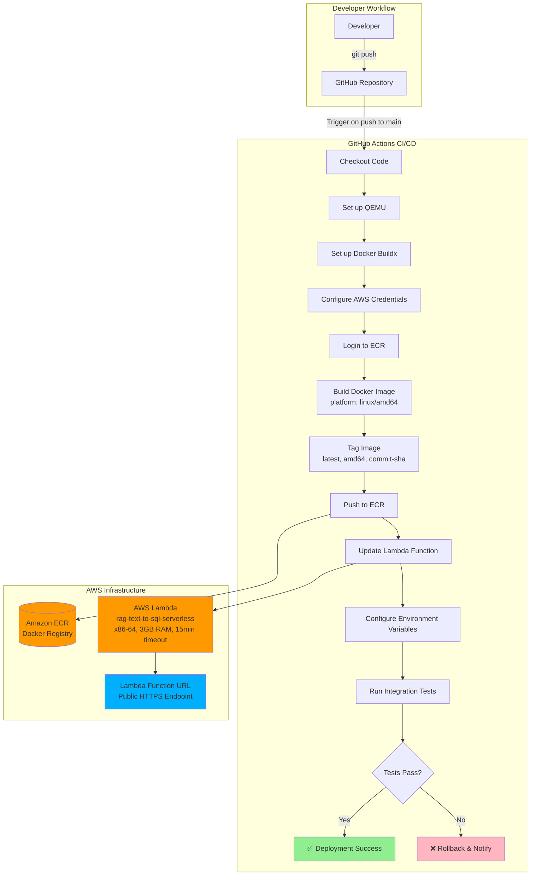
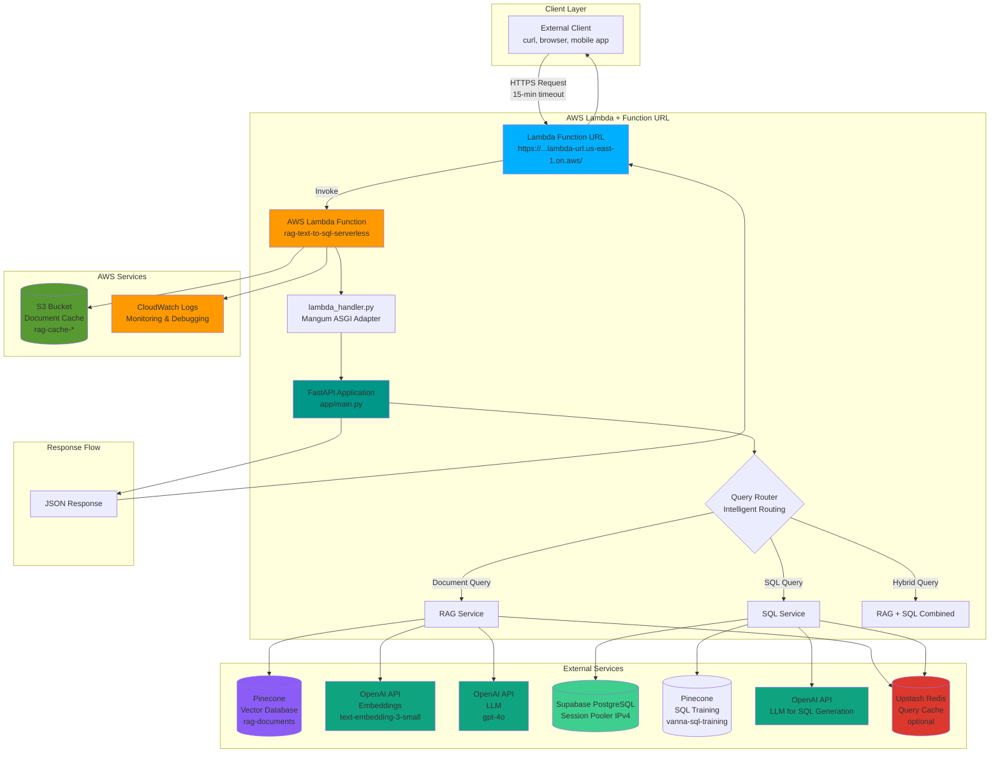
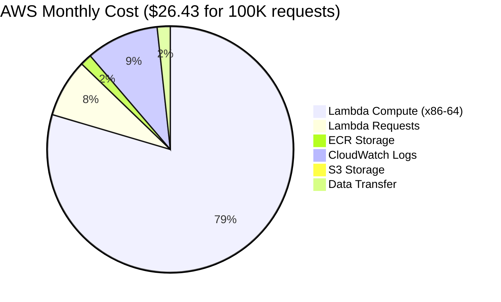
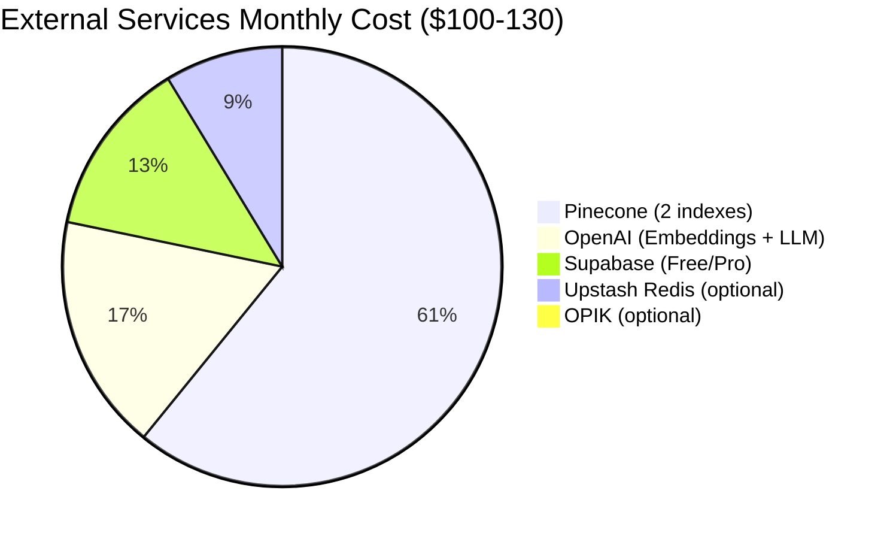

# AWS Lambda Deployment Architecture - Mermaid Diagrams

**Project:** Multi-Source RAG + Text-to-SQL System
**Architecture:** AWS Lambda (x86-64) + Function URL + ECR + S3
**Last Updated:** 2026-01-25
**Deployment Method:** GitHub Actions CI/CD

---

## 1. CI/CD Deployment Flow

This diagram shows the automated deployment pipeline from code push to production.



---

## 2. Runtime Architecture & Request Flow

This diagram shows how requests flow through the system at runtime.




---


## 3. Cost Breakdown (Monthly Estimate)





---


## 4. Key Architecture Benefits

| Feature | Value | Benefit |
|---------|-------|---------|
| **Timeout** | 15 minutes (900s) | ✅ Handles large PDF processing (138s observed) |
| **No API Gateway** | $0 extra cost | ✅ Saves $0.10 per 100K requests |
| **x86-64 Architecture** | AMD64 | ✅ Stable PyTorch/ONNX, Dockling support |
| **Function URL** | Direct HTTPS access | ✅ Simpler architecture, fewer services |
| **S3 Cache** | Hash-based caching | ✅ Fast repeated uploads (cache_hit: true) |
| **Auto-scaling** | Lambda auto-scales | ✅ Handles traffic spikes automatically |
| **Container Image** | Docker via ECR | ✅ Full control over dependencies |

---


---

## Technical Specifications

### Lambda Configuration
- **Function Name:** `rag-text-to-sql-serverless`
- **Architecture:** x86-64 (AMD64)
- **Memory:** 3008 MB (3 GB)
- **Timeout:** 900 seconds (15 minutes)
- **Ephemeral Storage:** 10 GB (/tmp)
- **Runtime:** Container (Python 3.12)
- **Handler:** `lambda_handler.handler`

### Function URL Configuration
- **Auth Type:** NONE (public access)
- **CORS:** Allow all origins, methods, headers
- **Invoke Mode:** BUFFERED (wait for full response)
- **Permissions Required (2026):**
  - `lambda:InvokeFunctionUrl`
  - `lambda:InvokeFunction`

### Docker Image
- **Base Image:** `public.ecr.aws/lambda/python:3.12`
- **Platform:** linux/amd64
- **Size:** ~3.6 GB (optimized with multi-stage build)
- **Builder:** Docker Buildx with UV package manager
- **Tags:** `latest`, `amd64`, `{commit-sha}`

### Environment Variables
- `OPENAI_API_KEY` - OpenAI API key
- `PINECONE_API_KEY` - Pinecone API key
- `PINECONE_ENVIRONMENT` - us-east-1-aws
- `PINECONE_INDEX_NAME` - rag-documents
- `DATABASE_URL` - Supabase Session Pooler (IPv4)
- `S3_CACHE_BUCKET` - rag-cache-{account-id}
- `USE_DOCKLING` - true (x86-64 benefit)
- `STORAGE_BACKEND` - s3

---

## Quick Reference

### Test Endpoints
```bash
# Health check
curl "https://YOUR-FUNCTION-URL.lambda-url.us-east-1.on.aws/health"

# Upload document
curl -X POST "https://YOUR-FUNCTION-URL.lambda-url.us-east-1.on.aws/upload" \
  -F "file=@document.pdf"

# Query documents
curl -X POST "https://YOUR-FUNCTION-URL.lambda-url.us-east-1.on.aws/query" \
  -H "Content-Type: application/json" \
  -d '{"query": "What is the return policy?"}'
```

### Monitoring
```bash
# View logs
aws logs tail /aws/lambda/rag-text-to-sql-serverless --follow

# Check function status
aws lambda get-function --function-name rag-text-to-sql-serverless

# Get Function URL
aws lambda get-function-url-config --function-name rag-text-to-sql-serverless
```

### Deployment
```bash
# Trigger deployment
git push origin main

# Monitor in GitHub Actions
# https://github.com/YOUR-USERNAME/YOUR-REPO/actions
```

---

**Document Created:** 2026-01-25
**Architecture:** AWS Lambda (x86-64) + Function URL + ECR + S3
**Total Monthly Cost:** ~$125-157 (100K requests/month)
**Key Advantage:** 15-minute timeout for large PDF processing
